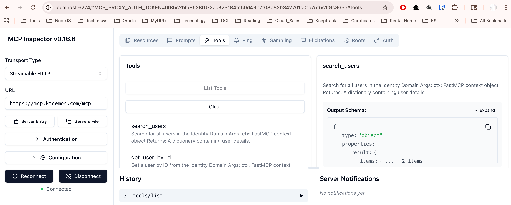
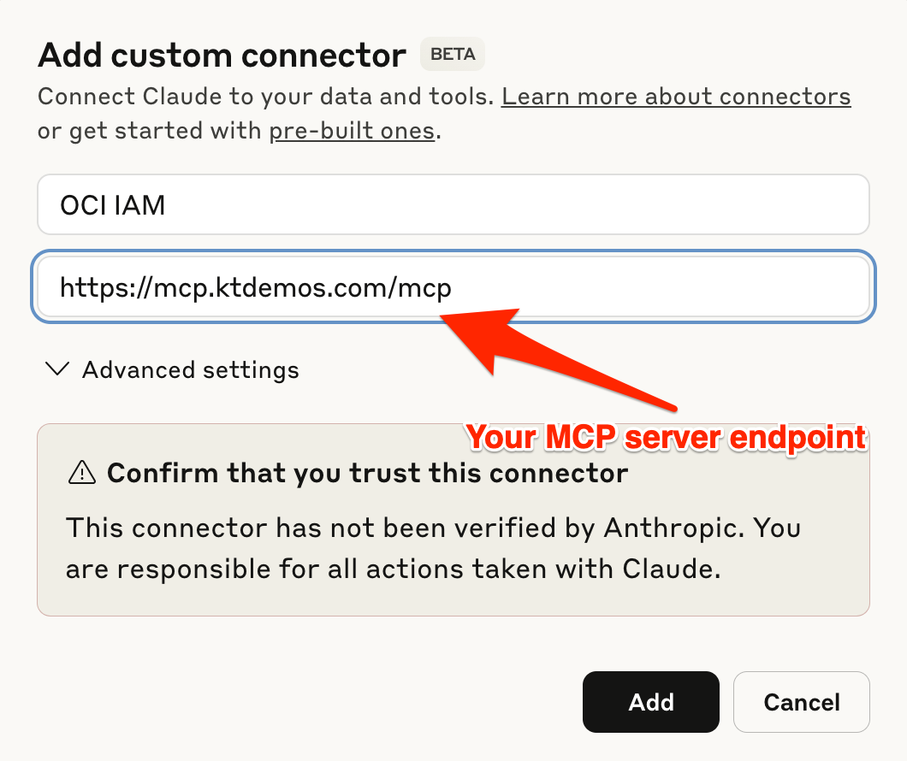
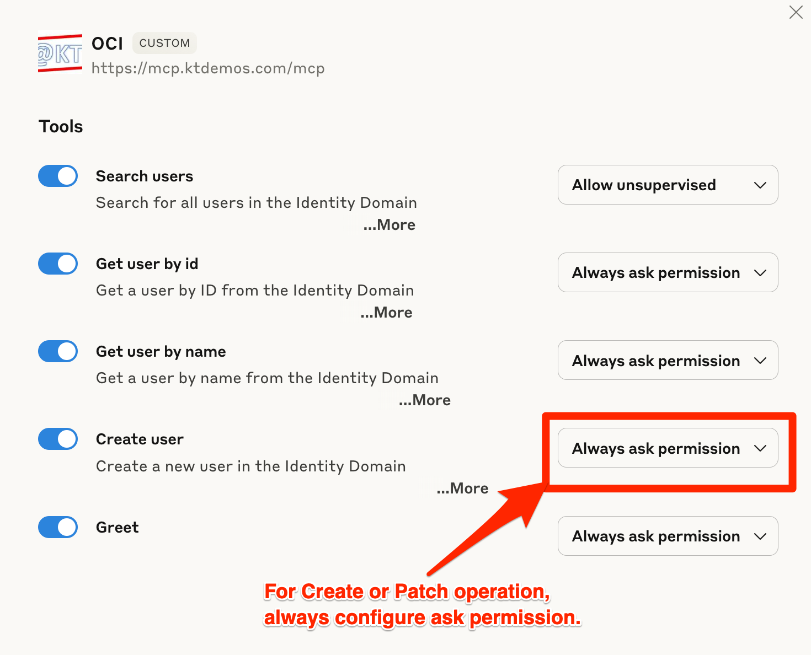
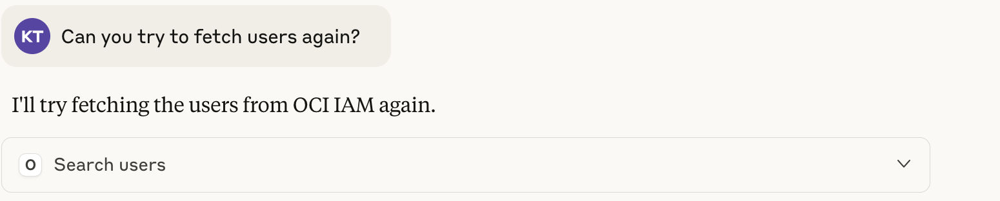

# Overview
The OCI IAM MCP Server is a tool that enables AI models to interact directly with your OCI IAM environment using the Model Context Protocol (MCP). Built specifically for IAM engineers, security teams, and OCI administrators, it implements the MCP specification to transform how AI assistants can help manage and analyze OCI IAM resources.

To learn more about MCP, [Refer to Go fastmcp documentation.](https://gofastmcp.com/getting-started/welcome)

# Available Tools

OCI IAM MCP server currently supports following tools:

**User Management**

- Search Users
- Get User by ID or Name
- Create User

This the very first version of OCI IAM MCP server. I will add more tools in the MCP server. This can be extended to support MCP servers for other OCI services as well.

# QuickStart

**Pre Requisites**

- Python 3.13 or later version
- oci cli 
- An MCP compatible AI client or you can test MCP server using Interpreter as well

**Installation**

```
# Clone the repository
git clone https://github.com/kiranthakkar/ocimcp.git
cd ocimcp-master

# Create and activate a virtual environment
python -m venv venv
source venv/bin/activate  # On Windows use: venv\Scripts\activate

# Install dependencies
pip install -r requirements.txt
```

**Configuration & Usage**

In the config folder, create a copy of config.ini.SAMPLE and edit the configuration file.

Now you can run MCP server using the below command.
fastmcp run server.py --transport http --host $HOSTNAME --port $IPADDRESS

To test MCP server using Interpreter, start Interpreter using the below command.
fastmcp dev server.py



To test MCP server with AI tool, setup RP and SSL frontend for the MCP server. Then you can add MCP server to AI tool. For Claude, you can add MCP server as below.







💡 Feature Requests & Ideas
Have an idea or suggestion? Open a feature request on GitHub!

👥 Contributors
Interested in contributing? We'd love to have you! Contact thakkar.kiran@gmail.com for collaboration opportunities.

⚖️ Legal Stuff
Check out License.md for the fine print.


